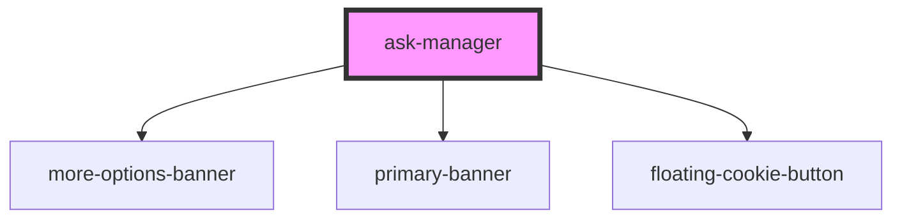

# ask-manager

<!-- Auto Generated Below -->

## Events

| Event            | Description                                   | Type                    |
| ---------------- | --------------------------------------------- | ----------------------- |
| `consentUpdated` | Event when the user has updated their consent | `CustomEvent<string[]>` |

## Methods

### `deleteConsent() => Promise<void>`

Delete all previous set consents

#### Returns

Type: `Promise<void>`

### `getCategoriesWithConsent() => Promise<any[]>`

Get the categories that the user has consented to

#### Returns

Type: `Promise<any[]>`

An array with the keys of all cookies that the user has consented to

### `hasConsent(key: string) => Promise<boolean>`

Check if the user has conseted to a particular category

#### Returns

Type: `Promise<boolean>`

Whether the user has consented to that cookie

### `hideBanner() => Promise<void>`

#### Returns

Type: `Promise<void>`

### `setOptions(userOptions: Options) => Promise<void>`

Set the options used for the component. Is required to run at initialization, but can be run any number of times after that

#### Returns

Type: `Promise<void>`

### `setStyling(newStyling: StylingOptions) => Promise<void>`

Set the styling used for the component.
Any undefined properties will use the last defined value for that property, the default value are only used if it has never been defined.
Can be run any number of times.

#### Returns

Type: `Promise<void>`

### `showBanner() => Promise<void>`

Make the banner reappear

#### Returns

Type: `Promise<void>`

## Dependencies

### Depends on

- [more-options-banner](../more-options-banner)
- [primary-banner](../primary-banner)
- [floating-cookie-button](../floating-cookie-button)

### Graph

----------------------------------------------

*Built with [StencilJS](https://stenciljs.com/)*
