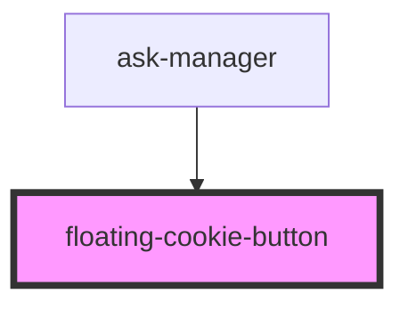

# floating-cookie-button

<!-- Auto Generated Below -->

## Properties

| Property     | Attribute | Description | Type         | Default     |
| ------------ | --------- | ----------- | ------------ | ----------- |
| `showBanner` | --        |             | `() => void` | `undefined` |

## Methods

### `changeColor(background: string, foreground: string) => Promise<void>`

#### Returns

Type: `Promise<void>`

## Dependencies

### Used by

 - [ask-manager](../ask-manager)

### Graph

----------------------------------------------

*Built with [StencilJS](https://stenciljs.com/)*
