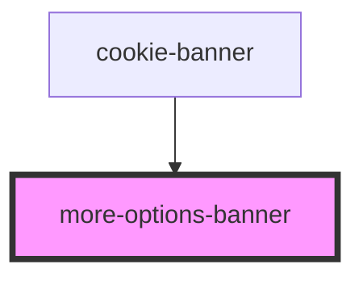

# more-options-banner

<!-- Auto Generated Below -->

## Properties

| Property             | Attribute | Description                                                                             | Type                             | Default     |
| -------------------- | --------- | --------------------------------------------------------------------------------------- | -------------------------------- | ----------- |
| `acceptCategories`   | --        | A function to use when accepting categories                                             | `(categories: string[]) => void` | `undefined` |
| `acceptedCategories` | --        | The categories that are already accepted and should be shown as pre-checked to the user | `string[]`                       | `[]`        |
| `hideOptions`        | --        | A function to no longer set the options view as the active one                          | `() => void`                     | `undefined` |

## Dependencies

### Used by

 - [cookie-banner](../cookie-banner)

### Graph

----------------------------------------------

*Built with [StencilJS](https://stenciljs.com/)*
