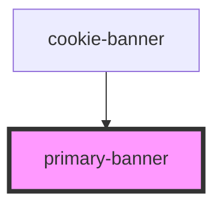

# primary-banner

<!-- Auto Generated Below -->

## Properties

| Property           | Attribute | Description                                          | Type                             | Default     |
| ------------------ | --------- | ---------------------------------------------------- | -------------------------------- | ----------- |
| `acceptCategories` | --        | A function to use when accepting categories          | `(categories: string[]) => void` | `undefined` |
| `showOptions`      | --        | A function to set the options view as the active one | `() => void`                     | `undefined` |

## Dependencies

### Used by

 - [cookie-banner](../cookie-banner)

### Graph

----------------------------------------------

*Built with [StencilJS](https://stenciljs.com/)*
