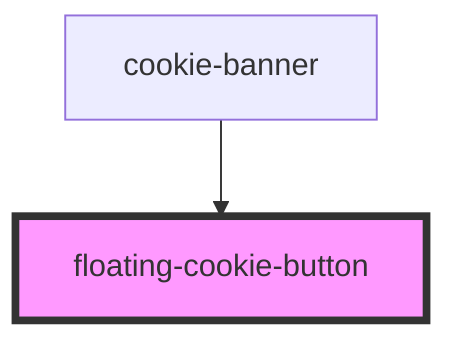

# floating-cookie-button

<!-- Auto Generated Below -->

## Properties

| Property     | Attribute | Description                            | Type         | Default     |
| ------------ | --------- | -------------------------------------- | ------------ | ----------- |
| `showBanner` | --        | A function to make the banner reappear | `() => void` | `undefined` |

## Methods

### `changeColor(background: string, foreground: string) => Promise<void>`

Change the color of the cookie button

#### Returns

Type: `Promise<void>`

## Dependencies

### Used by

 - [cookie-banner](../cookie-banner)

### Graph

----------------------------------------------

*Built with [StencilJS](https://stenciljs.com/)*
